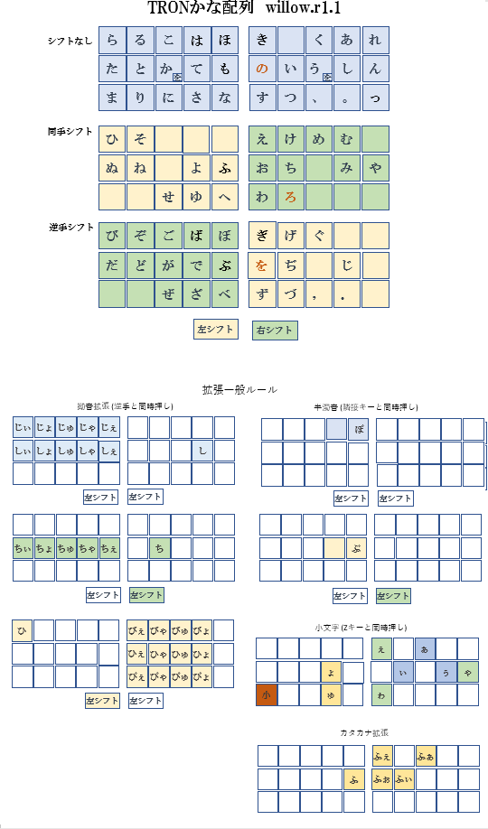

# tron_kana_willow
Japanese KANA Input method base on TRON.

TRONかな配列をベースとして様々な拡張を施した、親指シフト実装です。

やまぶきR Ver. 1.11.1 で動作確認しています。 
  - やまぶきR  http://yamakey.seesaa.net/category/8364446-1.html

作者
  -  はなち 
     - twitter @haswellep
     - mail  willow.keyboard@gmail.com

